# ZeroPress Studio

A modern, lightweight, and secure alternative to WordPress.

ZeroPress Studio is a content publishing platform built on top of a static site generator. It preserves the familiar authoring experience of WordPress while eliminating the operational overhead and security exposure associated with running a dynamic server. Authors focus on writing; ZeroPress handles publishing, hosting, and maintenance.

---

## Overview

| WordPress | ZeroPress Studio |
| --- | --- |
| Recurring hosting and server maintenance | No server runtime; deploys as static files |
| Frequent plugin security patches | Minimal attack surface; no database or PHP runtime exposed |
| Database backups and version upgrades | No database to maintain |
| Paid AI plugins and third-party integrations | AI writing assistant and image generation included |

---

## Project Status

ZeroPress is currently in **alpha** and is actively used by the development team in production workflows. The product is under continuous improvement, and we are working toward a general availability release. APIs, data formats, and user interfaces may change without notice during the alpha period.

---

## Product Preview

### Dashboard

Provides a consolidated overview of publishing activity, recent edits, and traffic summaries.

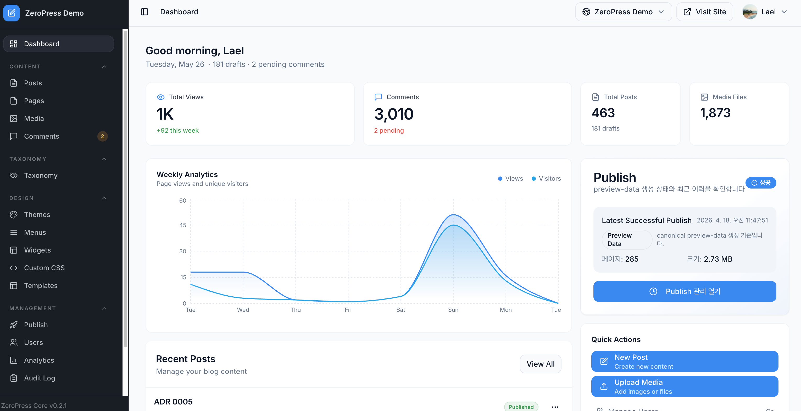

### Post Management

Supports search, filtering, and bulk operations across posts through a list-based interface.

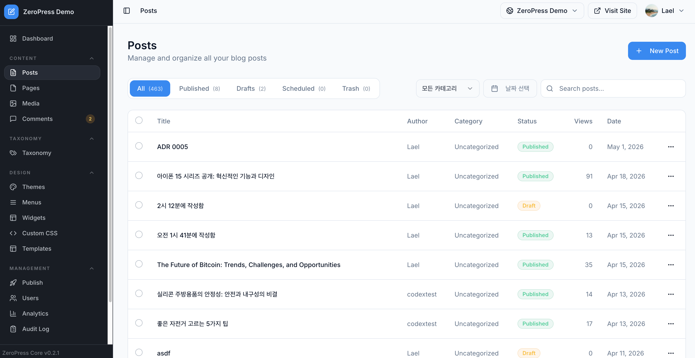

### Editor

Combines Markdown input and block-based editing in a single authoring environment.

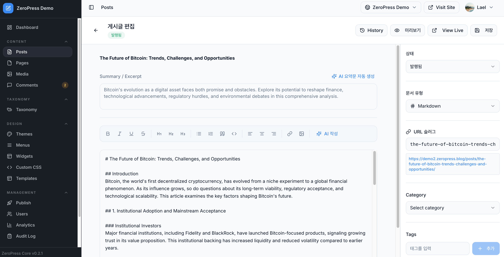

---

## Built-in AI

### AI Writing Assistant

Provides title generation, paragraph rewriting, summarization, and translation directly within the editor. No additional subscription is required.

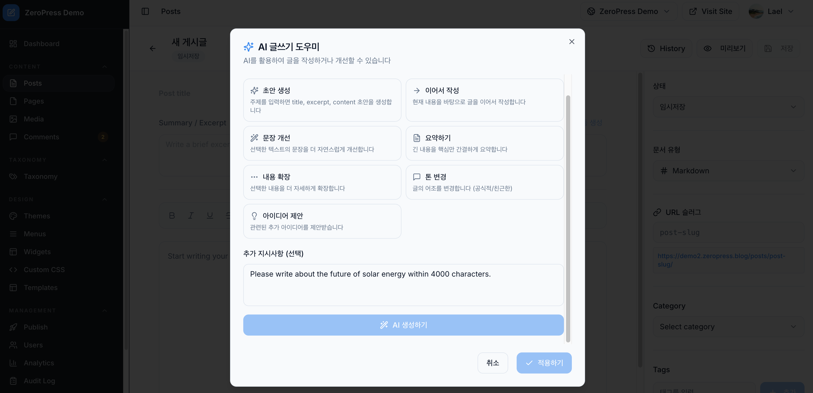

### AI Image Generation

Generates images from natural language descriptions without requiring third-party accounts or API keys.

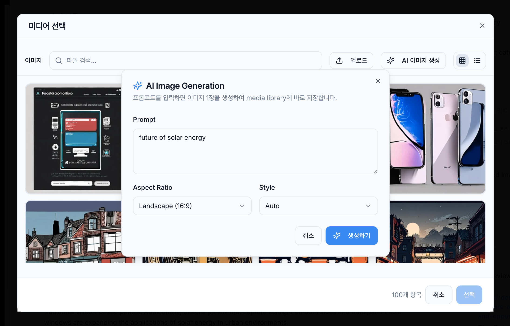
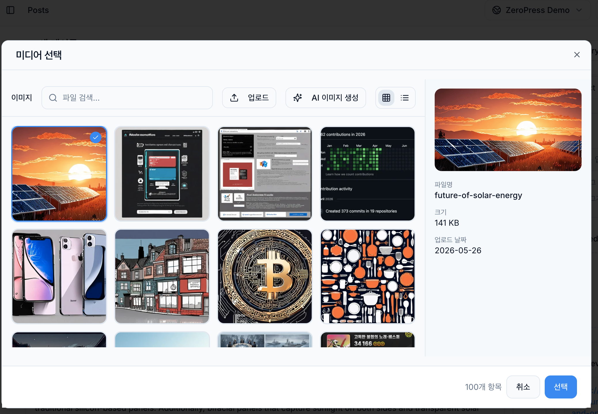

---

## Content Operations

### Media Library

Centralized management of images, videos, and other attachments, including upload, search, and reuse.

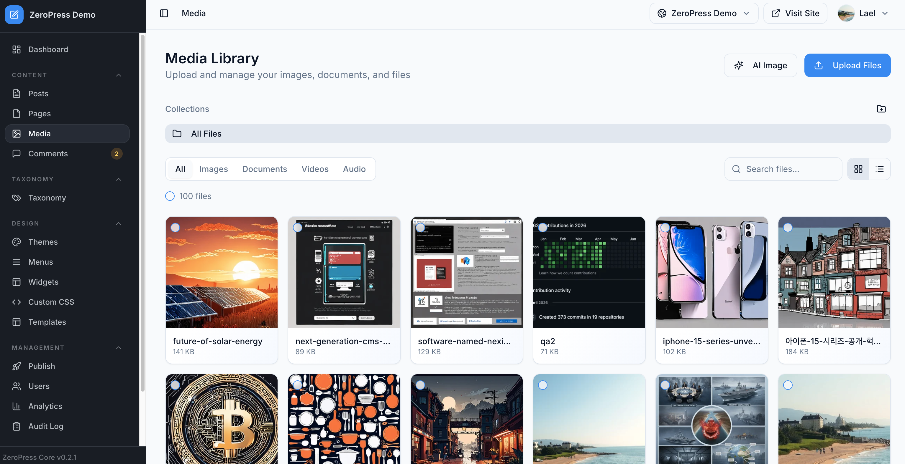

### Taxonomy

Configurable categories and tags for structured content organization.

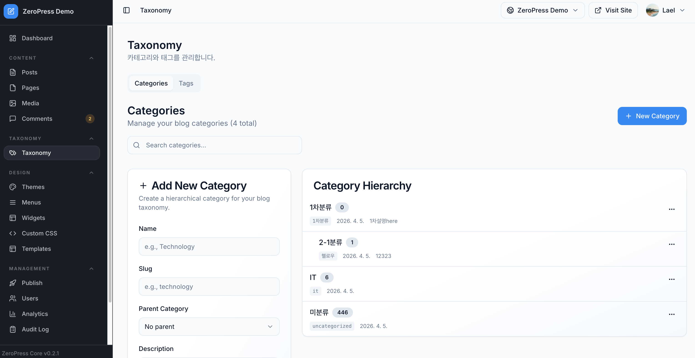

---

## Site Design

### Themes

A selection of themes is provided, with support for customization to match brand identity.

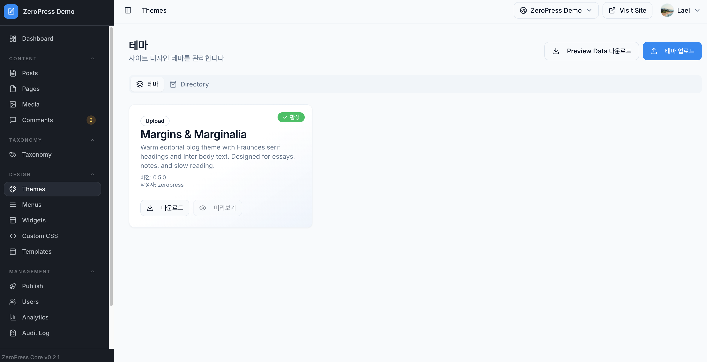

### Menus

Header and footer navigation is configured through a drag-and-drop interface.

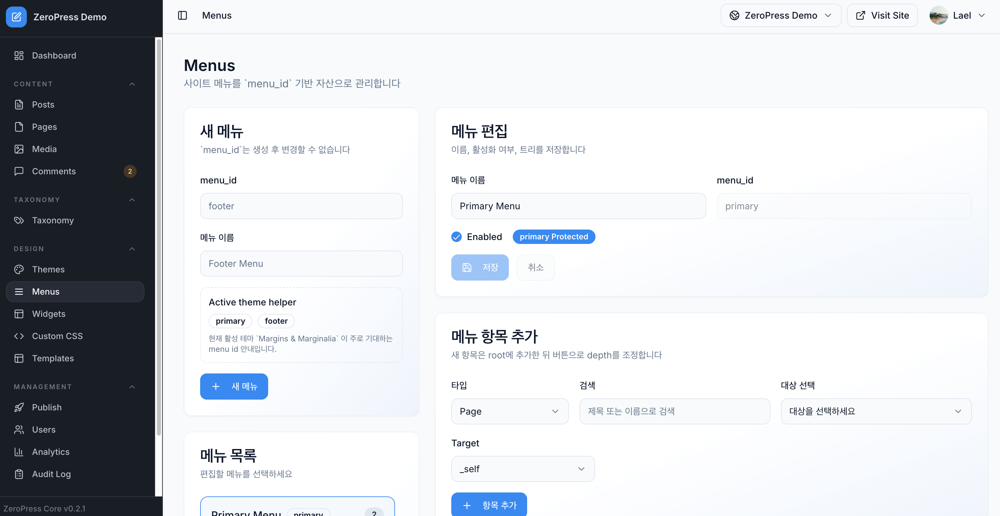

### Widgets

Widgets can be placed in sidebars and footers to extend page layouts.

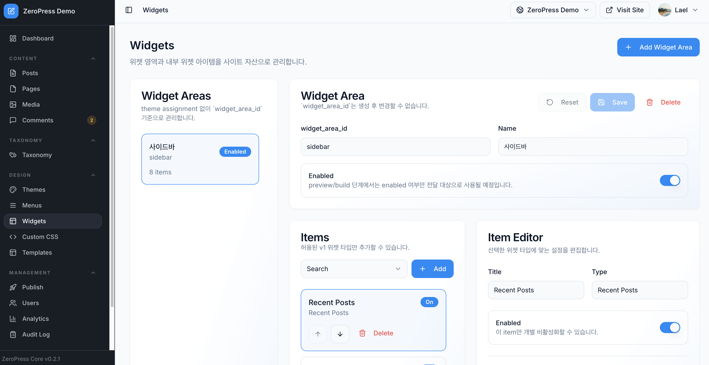

### Custom CSS

Custom CSS may be applied for fine-grained styling beyond the theme defaults.

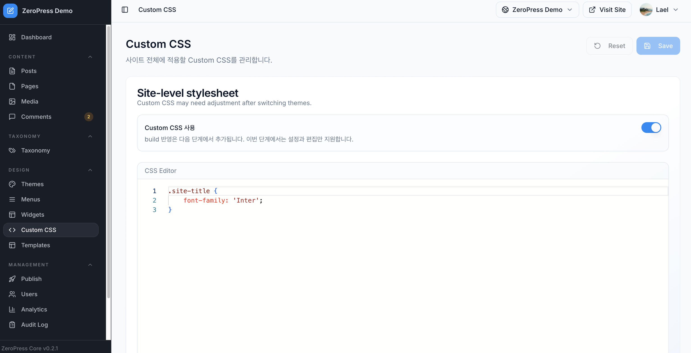

### Page Templates

Reusable templates are available for common page types, including landing, about, and contact pages.

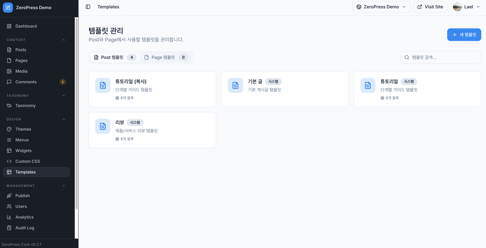

---

## Publishing and Deployment

Content is built as static files and deployed in a single operation. No server runtime is required, and deployments do not introduce downtime.

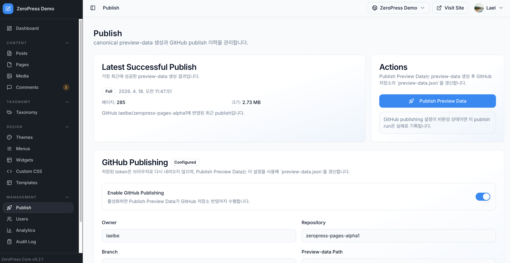

---

## Collaboration and Operations

### User Management

Role-based access control is provided to support multi-user collaboration.

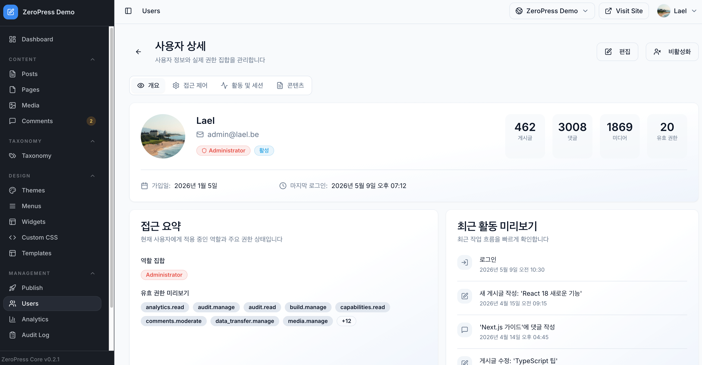

### Analytics

A built-in analytics dashboard reports visitor counts, popular posts, and traffic trends.

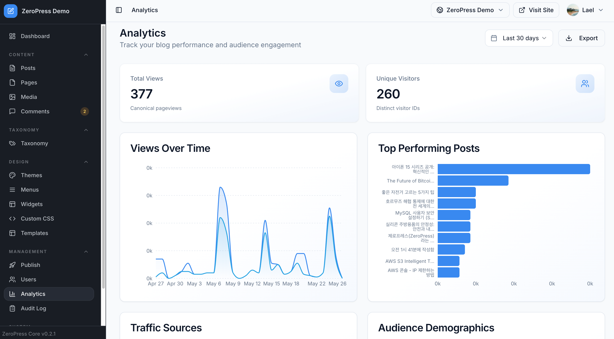

---

## Configuration

### General Settings

Site metadata, SEO options, and publishing preferences are managed in a unified settings panel.

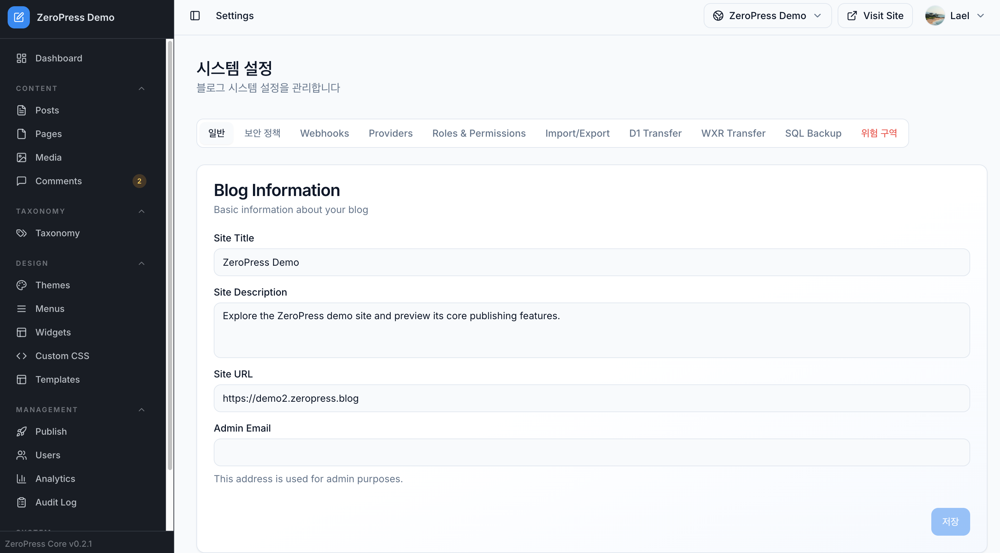

### Account Security

Two-factor authentication and an activity log are provided for account protection and auditing.

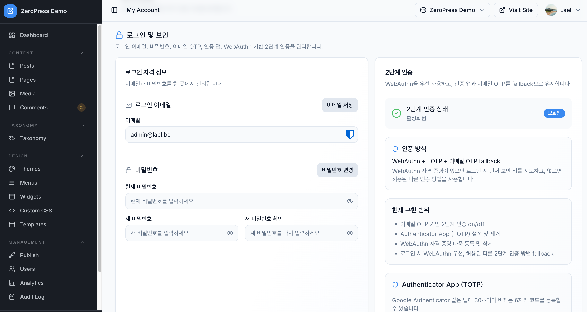

### Infrastructure Usage

Build time, storage, and bandwidth consumption are reported through the usage dashboard.

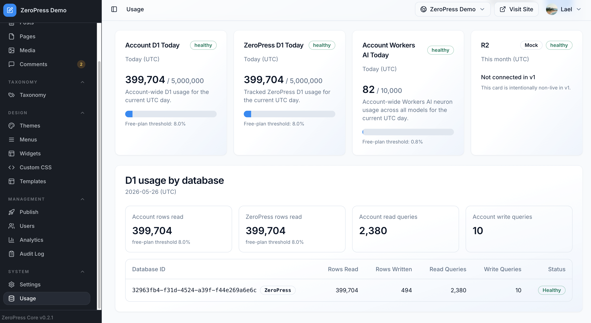

---

## Feedback

Feedback from alpha users is welcomed and informs ongoing development priorities.

## License

Refer to the [LICENSE](./LICENSE) file for licensing terms.
