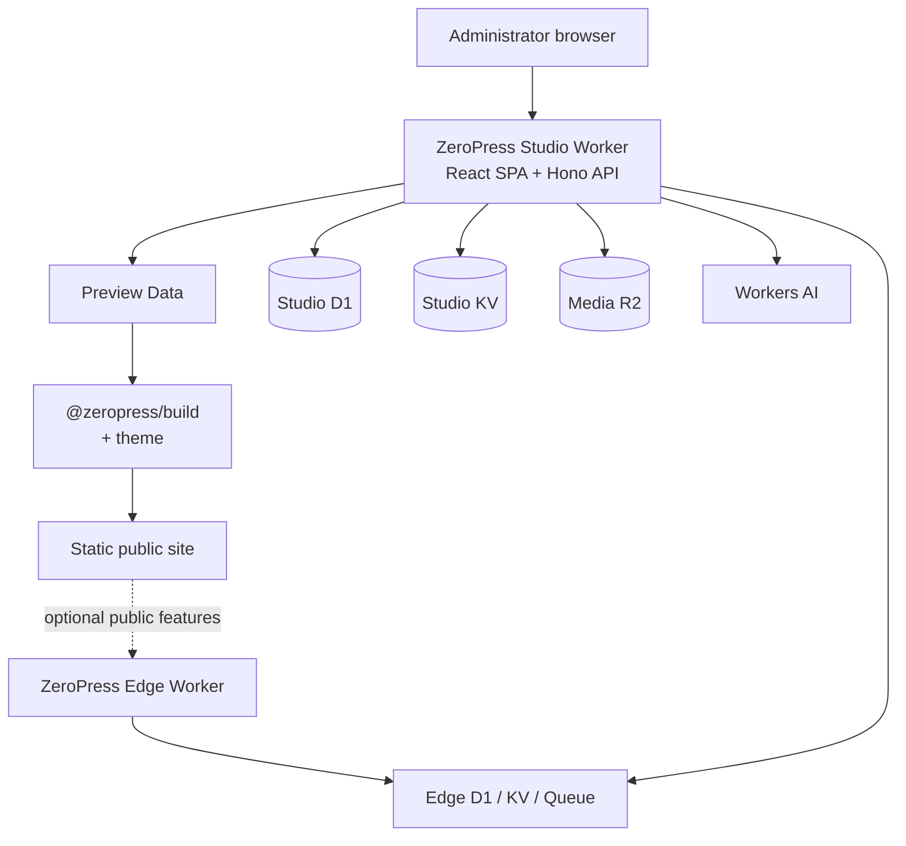

# ZeroPress Studio

[](https://deploy.workers.cloudflare.com/?url=https://github.com/zeropress-app/zeropress-studio/tree/latest)

Self-hosted content management and publishing control for ZeroPress, built for
Cloudflare Workers.

ZeroPress Studio brings content, media, site configuration, user access, and
operational tools together in one private administration application. It
deploys a React interface and a Hono API as a single same-origin Cloudflare
Worker, while keeping the public site on the static ZeroPress publishing path.

## What Studio provides

- Post and Page authoring with visual and source editing, autosave, and revision
  history
- Public Authors, Categories, Tags, Media, Menus, and Widgets
- Site identity, routing, output, branding, localization, and custom-code
  settings
- WordPress WXR import and validated Preview Data export
- Comment moderation, Forms, Newsletters, and mail delivery management through
  an optional ZeroPress Edge integration
- Role-based administration for administrators, editors, and authors
- Mandatory authenticator-app MFA, optional Passkeys and security keys, and
  active-session management
- Optional Cloudflare Access verification as an additional infrastructure
  boundary
- Database lifecycle, backup, recovery, reconciliation, and upgrade tools in a
  separately protected Operations area
- English and Korean Studio interfaces

Studio is the authoring and control plane. It does not build or host the public
site itself. A validated Preview Data document is handed to the ZeroPress build
tooling and a theme to produce static output. ZeroPress Edge remains a separate,
optional runtime for public interactions such as comments, Forms, and
Newsletters.

## Architecture



## Requirements

- Node.js 22.22.0 or newer
- A Cloudflare account that can deploy Workers with all resources declared in
  [`wrangler.jsonc`](wrangler.jsonc)

Deploy to Cloudflare creates or connects the declared resources before Worker
deployment. A provisioning failure stops deployment. Keep the resource
identifiers recorded in `wrangler.jsonc` in the deployment repository.

The default configuration includes Edge D1 and KV bindings even when the public
Edge Worker is not used. Feature usage is optional; the declared bindings are
required for deployment.

Use [Quick Start](https://studio.zeropress.dev/getting-started/) for initial
database setup and the resulting Edge integration state. Worker Secret handling
is documented separately in the
[Worker Secrets guide](https://studio.zeropress.dev/getting-started/worker-secrets/).

Authentication attempt limits and failure behavior are documented in
[Authentication rate limits](docs/authentication-rate-limits.md).

## Local development

Install the locked dependencies and start the local Worker:

```bash
npm ci
npm run dev
```

On first run, `npm run dev` creates an ignored `.dev.vars` file with
`STUDIO_SITE_MODE=initial` and separate random values for `STUDIO_AUTH_SECRET`
and `STUDIO_INSTALL_TOKEN`. If a local `.dev.vars` or `.env` configuration
already exists, it is used without modification.

Open the URL printed by Vite and use `STUDIO_INSTALL_TOKEN` from your local
environment file to begin installation. After installation, remove that token,
set `STUDIO_SITE_MODE=operational`, and restart development. Preserve
`STUDIO_AUTH_SECRET` when reusing a local database, and never commit Secrets.

Default development and preview use local D1, KV, R2, Queue, and Rate Limiting
bindings. Workers AI is unavailable in these workflows, even if its source
configuration sets `remote: true`.

For remote development, set exact `remote: true` on the selected Studio
resources in `wrangler.jsonc`. `DB` and `MEDIA_BUCKET` must share one locality;
`EDGE_DB` and `EDGE_KV` must remain local. This command requires at least one
remote opt-in and may read or mutate real resources:

```bash
npm run dev:enable-remote
```

To build and preview Studio locally:

```bash
npm run preview
```

`npm run dev -- --host 0.0.0.0` and `npm run preview -- --host 0.0.0.0`
allow LAN access and identify clients by their socket IP.
In Vite dev or preview, press `t + Enter` to open or close a Quick Tunnel.
Studio preserves its visitor IPs; see the supported
[client IP policy](docs/authentication-rate-limits.md).
`npm run preview:wrangler` is restricted to `127.0.0.1` for Wrangler-specific
diagnosis. Do not run development or preview commands concurrently against the
same local persistence directory.

## Validation

Run the package checks locally:

```bash
npm test
npm run typecheck
npm run format:wrangler:check
npm run build
npm run test:e2e
```

Build and E2E share `dist/`, so run them sequentially. E2E leaves local-preview
output; run `npm run build` again before deployment. See the
[E2E guide](e2e/README.md) for browser installation, isolation, and artifact
privacy.

## Installation configuration and deployment

Review the Worker name and D1, KV, R2, Queue, and rate-limit identifiers in
`wrangler.jsonc`. `MAIL_QUEUE` must have both a producer and a consumer using
the same Queue name.

After editing `wrangler.jsonc`, run `npm run format:wrangler` to match Wrangler's
formatting.

Manage runtime variables and Secrets in the Worker Dashboard. The source
configuration declares no `vars` and keeps `keep_vars: true` to preserve
Dashboard variables during code deployments.

```bash
npm run build          # build once and prepare deployment output
npm run deploy         # deploy the prepared build without rebuilding
npm run deploy:dry-run # build once, then validate deployment without uploading
```

For Cloudflare Workers Builds, use the default build command `npm run build`
and deploy command `npm run deploy`.

Deployment requires a successful ordinary build matching the current
`wrangler.jsonc`. The deploy command displays the target Worker and stops if
configuration values changed, the build failed, or the output is missing or from
local preview. Run `npm run build` again after configuration changes, including
resource IDs written to `wrangler.jsonc` by Wrangler during provisioning.
Formatting, comments, and object property order do not require a rebuild.
The public configuration builds without installation credentials. Ordinary
builds exclude local `.dev.vars` values; development and local preview may
consume them.

To recreate a Worker with existing KV namespaces, set their `id` values in
`wrangler.jsonc`, then rebuild and deploy. Find the IDs in the Cloudflare
Dashboard or with `npx wrangler kv namespace list`. Git-connected builds do not
write provisioned IDs back to the repository.

## Operations and security

Studio fails closed when its site mode, required Secrets, or database lifecycle
state is not valid. Installation, normal operation, maintenance, and recovery
are explicit modes rather than implicit fallbacks.

The `/system/operations` area is outside the normal Studio application shell and
uses its own IP allowlist and token boundary. It contains destructive and
lifecycle-sensitive actions; review the generated previews and backups before
applying an operation.

Relevant references:

- [Cloudflare Access integration](docs/cloudflare-access.md)
- [Maintenance and recovery](docs/maintenance-and-recovery.md)
- [Operational log policy](docs/operational-log-policy.md)
- [Operational log catalog](docs/operational-log-catalog.md)

Report vulnerabilities privately using the [security policy](SECURITY.md).

## Related projects

- [ZeroPress Edge](https://github.com/zeropress-app/zeropress-edge) provides the
  optional public runtime for interactive features.
- [ZeroPress Build](https://github.com/zeropress-app/zeropress-build) turns
  Preview Data and a ZeroPress theme into static output.
- The [ZeroPress organization](https://github.com/zeropress-app) contains the
  wider publishing toolchain and contracts.

## License

ZeroPress Studio is released under the
[Apache License 2.0](LICENSE).

Passkey authenticator names use a bundled snapshot from
[passkey-authenticator-aaguids](https://github.com/passkeydeveloper/passkey-authenticator-aaguids).
